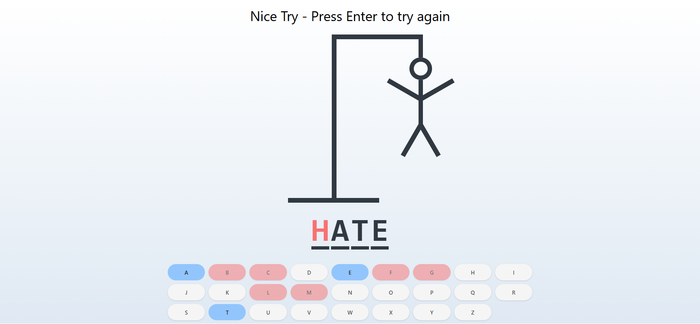

<div align="center">
  
 <div>
  
  
  
  </div>
  <h3 align="center">Hangman-typeScript</h3>
</div>

## <br /> 📋 <a name="table">Summary</a>

- ✨ [Introduction](#introduction)
- 🛠 [Technology Used](#tech-stack)
- 📝 [Features](#features)
- 🚀 [Launch App](#launch-app)
- 🎨 [Styling](#style)


## <br /> <a name="introduction">✨ Introduction</a>

**[ENG]** This project is a classic Hangman game built using TypeScript, Tailwind CSS, and Vite. It offers a fun and interactive experience where players guess letters to reveal a hidden word.

**[FR]** Ce projet est un jeu de Pendu classique construit à l'aide de TypeScript, Tailwind CSS et Vite. Il offre une expérience amusante et interactive où les joueurs devinent des lettres pour révéler un mot caché.

## <br /> <a name="tech-stack">🛠 Technology Used</a>

- [TailwindCSS](https://tailwindcss.com/docs/installation)
Tailwind CSS is a valuable tool for developers who want to build modern, responsive, and visually appealing websites without sacrificing development speed.

## <a name="features">📝 Features</a>

👉 **Word Generation** : Generates a random word from a predefined list.

👉 **Word Display**: Displays the word as a series of underscores, revealing guessed letters.

👉 **Keyboard Input:** :

  - **Keyboard** : Players can use their physical keyboard to input guesses.

  - **On-screen Keyboard**: Players can click on virtual keyboard buttons to input guesses. 
  
👉 **Letter Disabling**: Once a letter is guessed, it is disabled to prevent repeated guesses.

👉 **Win/Lose Conditions** :

  - **Win** : The player wins by guessing all letters correctly. Correct guesses are displayed in blue.

  - **Lose** : The player loses if they exhaust all incorrect guesses. Incorrect guesses are displayed in red. 


## <br /> <a name="launch-app">🚀 Launch App</a>

Follow these steps to set up the project locally on your machine.

**Prerequisites**

> [!NOTE]
> Make sure you have the following installed on your machine:

- [Git](https://git-scm.com/)
- [Node.js](https://nodejs.org/en)
- [npm](https://www.npmjs.com/) _(Node Package Manager)_

**Cloning the Repository**

```bash
git clone {git remote URL}
cd {git project..}
```

**Installation**

> After cloning the repository, run the command `npm i` or `yarn i` to install the project's dependencies.

_npm_

```
npm install
```

_yarn_

```
yarn install
```

> Once the dependencies are installed, start the project with the command `npm run dev`.

# <br /> <a name="style">🎨 Styling</a>

Global styling are defined using **CSS** & **TailwindCSS**

<details>
<summary><code>index.css</code></summary>

```css
@tailwind base;
@tailwind components;
@tailwind utilities;

* {
  margin: 0;
  padding: 0;
  box-sizing: border-box;
}

body {
  width: 100dvw;
  overflow-x: hidden;
  height: 100%;
  background: linear-gradient(to top, #dfe9f3 0%, white 100%);
}
```

</details>

<details>
<summary><code>tailwind.config.js</code></summary>

````cjs
theme: {
    extend: {
      colors: {
        blackLight: "#303841",
      },
        gridTemplateColumns:{
        'auto-fit-75': 'repeat (auto-fill, minmax(75px, 1fr)'
      }
    },
  },
````

</details>
